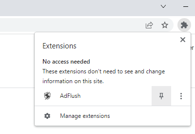
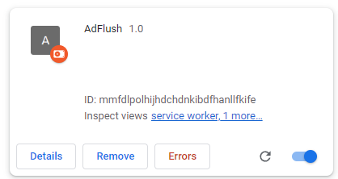

# Welcome to *AdFlush*

Document for paper *AdFlush: A Real-World Deployable Machine Learning Solution for Effective Advertisement and Web Tracker Prevention*, accepted to the Web Conference 2024, Singapore. 

*AdFlush* is the first advertisement and web tracker blocking Chrome Extension based on Machine Learning prediction. With thorough feature engineering process considering state-of-the-art methodology, *AdFlush* takes advantage of its lightweight and powerful classification ability to detect and block advertisement and web trackers preserving user privacy in the same time. Please refer to our paper for details of the framework and evaluation results of *AdFlush*.

# Abstract
Ad blocking and web tracking prevention tools are widely used, but traditional filter list-based methods struggle to cope with web content manipulation. Machine learning-based approaches have been proposed to address these limitations, but they have primarily focused on improving detection accuracy at the expense of practical considerations such as deployment overhead. In this paper, we present *AdFlush*, a lightweight machine learning model for ad blocking and web tracking prevention that is practically designed for the Chrome browser. To develop *AdFlush*, we first evaluated the effectiveness of 883 features, including 350 existing and 533 new features, and ultimately identified 27 key features that achieve optimal detection performance. We then evaluated *AdFlush* using a dataset of 10,000 real-world websites, achieving an F1 score of 0.98, which outperforms state-of-the-art models such as AdGraph (F1 score: 0.93), WebGraph (F1 score: 0.90), and WTAgraph (F1 score: 0.84). Importantly, *AdFlush* also exhibits a significantly reduced computational footprint, requiring 56% less CPU and 80% less memory than AdGraph. We also evaluated the robustness of *AdFlush* against adversarial manipulation, such as URL manipulation and JavaScript obfuscation. Our experimental results show that *AdFlush* exhibits superior robustness with F1 scores of 0.89–0.98, outperforming AdGraph and WebGraph, which achieved F1 scores of 0.81–0.87 against adversarial samples. To demonstrate the real-world applicability of *AdFlush*, we have implemented it as a Chrome browser extension and made it publicly available. We also conducted a six-month longitudinal study, which showed that *AdFlush* maintained a high F1 score above 0.97 without retraining, demonstrating its effectiveness. Additionally, *AdFlush* detected 642 URLs across 108 domains that were missed by commercial filter lists, which we reported to filter list providers.

The demo of exploring real-life web sites and detecting, blocking advertisements and trackers using *AdFlush* is available <a href="https://www.youtube.com/watch?v=dzdfqpiCjKg">here</a>.


[](https://youtu.be/dzdfqpiCjKg)

# **Preparing *AdFlush***

We recommend you to take advantage of our fully build Docker image to explore several processes and results of *AdFlush*. If not available, you can make yourself an environment to match *AdFlush*'s settings.
- A. ***(Recommended)*** Pull our Docker image and simply run the fully built container
- B. *(Alternative of A.)* Make a python environment from scratch
- C. *(Optional)* Simple steps to setup a Docker image of *AdFlush*

## A. Within Docker Image

### 1. Pull the Docker image
Run the following codes to pull the Docker image of *AdFlush* and start a container. 

```bash
$ apt-get install Docker.io
$ docker pull chaejinlim98330/adflush:artifact.v1
```

### 2. Start the Docker container
On first run: 
```bash
$ docker run -it --name adflush_con chaejinlim98330/adflush:artifact.v2
```
On post runs:
```bash
$ docker start -i adflush_con
```

### 3. Start python venv
```bash
container $ source adflushenv/bin/activate
(adflushenv) container $ cd source
```

### *(When closing AdFlush)*
To exit the docker container:
```bash
(adflushenv) container $ exit
```

## B. Within Python Environment

### 0. Prerequisites
1. This study has been run and tested in *Python==3.7.17*, in both following environments:
- *javac=17.0.7*, *Windows 10 Pro 22H2*
- *openjdk==11.0.19*, *Ubuntu 18.04.6 LTS (Bionic Beaver)*

A package used by *AdFlush*, H2O requires 64-bit JDK of versions over 7. You can download Java as the same version as tested from <a href="https://www.oracle.com/kr/java/technologies/javase/javase8u211-later-archive-downloads.html">here</a>. 

2. The git repository requires Git LFS (Large File Storage). If you do not have LFS, download it from <a href="https://git-lfs.com/">here</a>.

### 1.  Clone Repository
Setup the directory structure as it is the same as this GitHub repository. 

1. Move to the directory you want to import *AdFlush*.  
```bash
$ cd path/to/working/directory
```

2. Within the directory, run the following source codes.  
```bash
$ git clone https://github.com/SKKU-SecLab/AdFlush.git
$ git lfs pull
$ cd AdFlush
``` 

### 2. Python Venv
Build a python environment

```bash
$ python3 -m venv adflushenv
$ source adflushenv/bin/activate
(adflushenv) $ pip3 install -r requirements.txt
(adflushenv) $ cd source
```

### 3. Prepare Dataset
Download the `all_df_883_train.csv` .csv file from <a href="https://zenodo.org/records/10673857">here</a> to the directory `/path/to/working/directory/adflush/dataset`. 
You can see the proper location marked with `all_df_883_train.placeholder`.

## C. ***(Optional)*** Setup a Docker image of *AdFlush*

Run the following code to build a Docker image as the same steps of *AdFlush*. 
The saame codes are writtin in the comments of `/AdFlush/Dockerfile`. 
You can see the steps of building *Adflush*'s Docker image. 

```bash
$ docker build --tag adflush:custom.v1
$ docker run -it adflush:custom.v1
container $ apt-get install libbz2-dev liblzma-dev lzma zlib1g-dev
container $ npm init -y
container $ npm install fs acorn-loose
container $ tar -xvzf Python-3.7.17.tgz
container $ cd Python-3.7.17
container $ ./configure
container $ make altinstall
container $ cd /adflush
container $ python3.7 -m venv adflushenv
container $ source adflushenv/bin/activate
container $ python -m pip install --upgrade pip setuptools
container $ pip install requests tabulate future
container $ pip install -r requirements.txt
```

# **1. Exploring the processes of *AdFlush***

Run the code `python main.py -p [your options]` to follow processes and explore results of *AdFlush*. Available options are as below. Note that the process `performance-eval` requires the arguments -d {dataset} and -m {model}, and `train-gan` requires the argument -s {subset}. 

```bash
usage: main.py [-h] -p
               {feature-eng,model-sel,performance-eval,train-gan,extract-new-feat}
               [-d {testset,gan,gnirts,javascript-obfuscator,wobfuscator}]
               [-m {mojo,onnx,custom_mojo,custom_onnx}]
               [-s {adflush,webgraph,adgraph}]

Run AdFlush Experiments

optional arguments:
  -h, --help            show this help message and exit
  -p {feature-eng,model-sel,performance-eval,train-gan,extract-new-feat}
                        Experiment process you want to run
  -d {testset,gan,gnirts,javascript-obfuscator,wobfuscator,custom-gan}
                        Specify dataset during 'performance-eval'
  -m {mojo,onnx,custom_mojo,custom_onnx}
                        Specify model during 'performance-eval' *For custom,
                        follow model-sel process first.
  -s {adflush,webgraph,adgraph}
                        Specify model during 'train-gan'
```

## 1. Feature Enginnering Framework of AdFlush

Run `python main.py -p feature-eng` to follow the steps and reproduce the results of *AdFlush*'s feature engineering framework. The contents are:
1. Point-Biserial Correlation
2. *RFECV(Recursive Feature Elimination with Cross-Validation) Existing Features / New Robust Features
3. Pearson & Spearman
4. RFI-PI mean Importance

You can also see the results of RFECV in figures in `/adflush/output`. To fetch the figures from the docker container, run the following codes in another terminal. 

```bash
$ docker cp adflush_con:/adflush/output /path/to/fetch/figures/
```

**RFECV process requires many hours.*


## 2. Modeling AdFlush

Run `python main.py -p model-sel` and follow the steps to reproduce the model of *AdFlush* upon various datasets. The newly trained *AdFlush* is saved in `/adflush/model/`, where the mojo model is `AdFlush_custom/(name_of_model)` and the ONNX model is `AdFlush_custom.onnx`. 

After running this process, you can evaluate your custom *AdFlush* model by setting the `-m` argument as `custom_mojo` or `custom_onnx` in [3. Performance Evaluation](#performance_eval).

- We must note that the results of the source code may differ from the results in our paper. The ONNX convertion involves compatibility within multiple environments, nessecary for browser extension implementation. However in this way the limit of Opsets in conversion might act as an upperbound in model performance by degrading precise floating point computation. 

<hr>

## 3. Performance Evaluation <a name="performance_eval"></a>

Run the following code to reproduce the performance evaluation of *AdFlush*. 
```bash
(adflushenv) container $ python main.py -p performance-eval -m {model} -d {dataset}
```
Samples of running performance evaluation are below:
```bash
(adflushenv) container $ python main.py -p performance-eval -m mojo -d testset
[[Performance evaluation process of AdFlush using dataset:  testset , model:  mojo ]]
Loading model...
Inference time elapsed:  1.7641267776489258 seconds for  166032  samples.
Accuracy : 0.9865809000674569
Precision : 0.9890499244032438
Recall : 0.9772003681740679
F1 : 0.9830894407675026
False Negative Rate: 0.02279963182593213
False Positive Rate: 0.007187321444681683
AUROC:  0.9850065233646931
TPR  0.9772003681740679 at FPR  0.007187321444681683

(adflushenv) container $ python main.py -p performance-eval -m onnx -d javascript-obfuscator
[[Performance evaluation process of AdFlush using dataset:  javascript-obfuscator , model:  onnx ]]
Loading Model
Checking model integrity...
Running Inference Session
Inference time elapsed:  0.1128230094909668 seconds for  13695  samples.
Accuracy : 0.9516611902154071
Precision : 0.962189838519102
Recall : 0.9122479462285288
F1 : 0.9365535748514472
False Negative Rate: 0.08775205377147124
False Positive Rate: 0.02302434344645641
AUROC:  0.9446118013910361
TPR  0.9122479462285288 at FPR  0.02302434344645641
Attack Success Rate:  0.048338809784592915
...
```

## 4. Generate GAN mutated datasets
Run `python main.py -p train-gan -s {subset}` to train a new GAN as the robustness evaluation of *AdFlush* and create a custom mutated dataset. 

The output of the code will generate a mutated dataset from the newly trained GAN as `GAN_custom_mutated_{subset}.csv`. You can also use the mutated dataset to evaluate performance of *AdFlush* with the `-d` argument as `custom-gan` [here](#performance_eval). 

## 5. Encodings used in *AdFlush*
The details of encodings used in *AdFlush* are implemented in `/adflush/source/adflush_encodings.py`.

- `trainCharEmbeddings`: Train a custom character embedding dictionary using <a href=https://radimrehurek.com/gensim/models/word2vec.html>Word2Vec</a>. 
- `char2vec_pretrained`: Embed a url with *AdFlush*'s pretrained character embedding dictionaries.
- `extract_JS_Features`: Extract robust features as implemented in *AdFlush*. 
    - input: file name of HTML or JavaScript source code. Place the file within `/adflush/source/processing/` directory for proper use.

By running the following code, you can see samples of results of extracting robust features from actual JavaScript and HTML source codes. 

```bash
(adflushenv) container $ python main.py -p extract-new-feat

New features for processing/sample.js
         ast_depth:  78 ast_breadth:  34445 avg_ident:  0.2485594869073883  avg_charperline:  88165.66666666667 brackettodot:  2.64977523498161 num_requests_sent:  0 num_set_storage:  19 num_get_storage:  3 num_get_cookie:  1 ngram:  {'ng_15_15_0': 0.08983040866800142, 'ng_15_0_12': 0.006168295842656931, 'ng_0_12_4': 0.009259804498881169, 
         ...

New features for processing/sample.html
         ast_depth:  45 ast_breadth:  4809 avg_ident:  0.4763645860537999  avg_charperline:  8068.4 brackettodot:  8.0 num_requests_sent:  0 num_set_storage:  0 num_get_storage:  0 num_get_cookie:  0 ngram:  {'ng_15_15_3': 0.008132865336871842, 'ng_15_3_9': 0.0032103415803441484, 'ng_3_9_15': 0.002910709699512028, 'ng_9_15_3': 0.003039123362725794,
         ...
```

# **2. Within Chrome Extension**
The following browser extension is developed in `npm==9.5.1`. 

## Setting Up *AdFlush*

1. Open a Chrome web browser.  

2. Click on the options and navigate to `Extensions` > `Manage Extensions`.  
    

3. Click on `Manage Extensions` Within the page, click on `Load unpacked`. If you don't see this button, make sure you have enabled `Developer mode` on the right side of the page.  
    

4. Navigate to `path/to/working/directory/AdFlush/extension/dist` and select the folder.  
    

5. Open your extensions and pin *AdFlush* to utilize full functionalities.  
    

## Applying Modification to *AdFlush*
If you decide to apply some modifications within our chrome extension or want to customize behavior, you must use <a href="https://webpack.js.org/">webpack</a> to repack the extension reflecting your modifications.

1. Open a command line prompt and navigate to `path/to/working/directory/AdFlush/extension`. Run the source code below to install the packages required for *AdFlush* chrome extension.
```bash
npm install
```

2. When you are done applying modifications to *AdFlush*, un the source code below to pack the source codes with appropriate npm packages. 
```bash
npx webpack --config=webpack.config.js
```

3. Press the refresh button to reload *AdFlush* within your chrome extension and you are ready to run the modified *AdFlush*.  
    

# **3. Dataset**

We opensource our *AdFlush* dataset used within our study. Our dataset consists of top 10K web pages from Tranco list, crawled at the date April 4, 2023. We divided our dataset for training processes and evaluation by 8:2 ratio. We also provide the datasets obtained with our trained GAN or several JavaScript obfuscation and used in robustness evaluation. 
These are available in `./dataset` directory. The identical dataset is also provided <a href="https://zenodo.org/records/10673857">here</a> via Zenodo. 
- `AdFlush_train.csv`: Train set of *AdFlush*
- `AdFlush_test.csv`: Test set of *AdFlush*
- `all_df_883_`: Dataset collected by extracting all possible 883 features
- `GAN_mutated_` : GAN mutated test sets for each method
- `JS_obfuscated_`: JavaScript features obtained by each obfuscation method for *AdFlush*

(Optional) We collected our dataset from OpenWPM. To run all tasks (Graph building, Feature extraction or Classification) on WebGraph and AdGraph, the crawl data used is collected using a custom version of [OpenWPM](https://github.com/sandrasiby/OpenWPM/tree/webgraph). Follow the instructions [here](https://github.com/sandrasiby/OpenWPM/tree/webgraph#readme) to setup OpenWPM in your environment.
